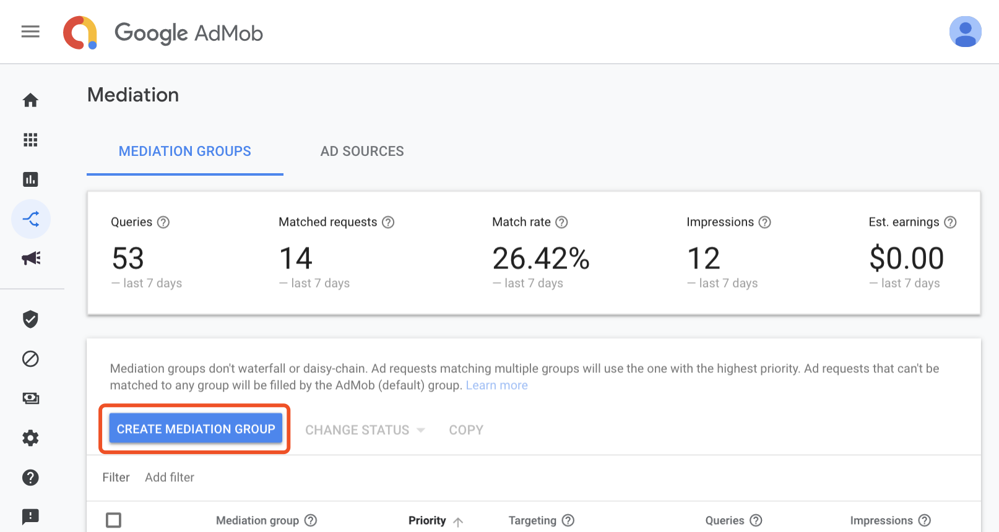
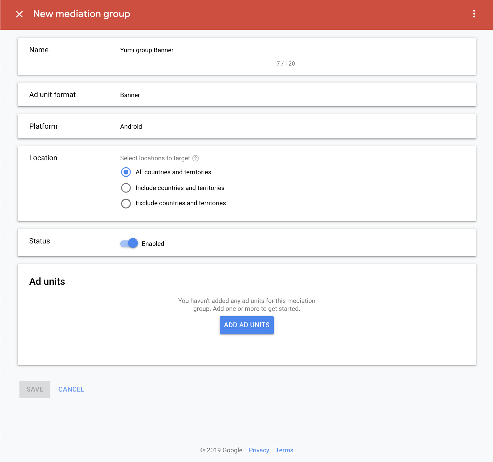
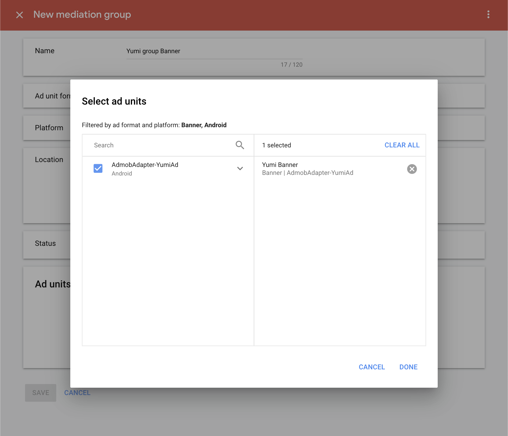
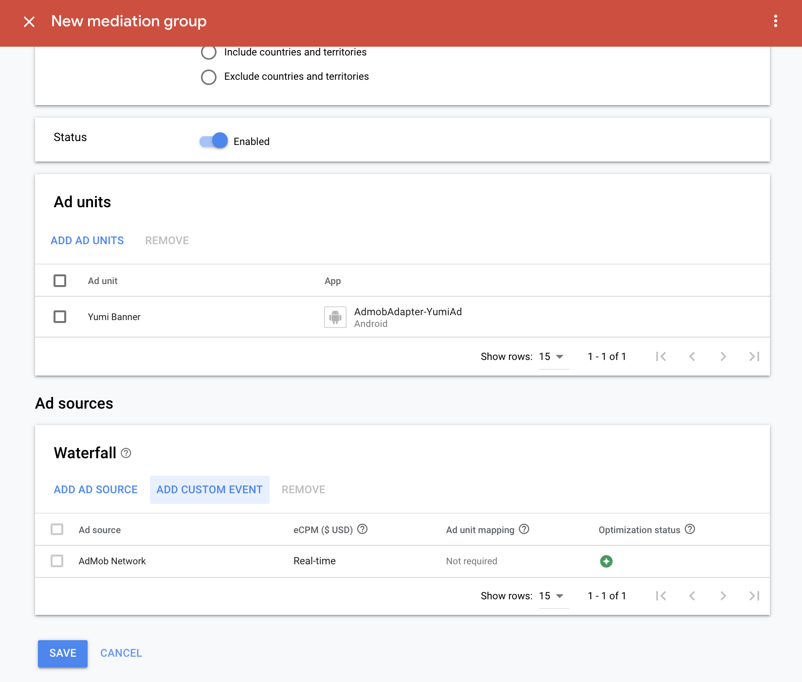
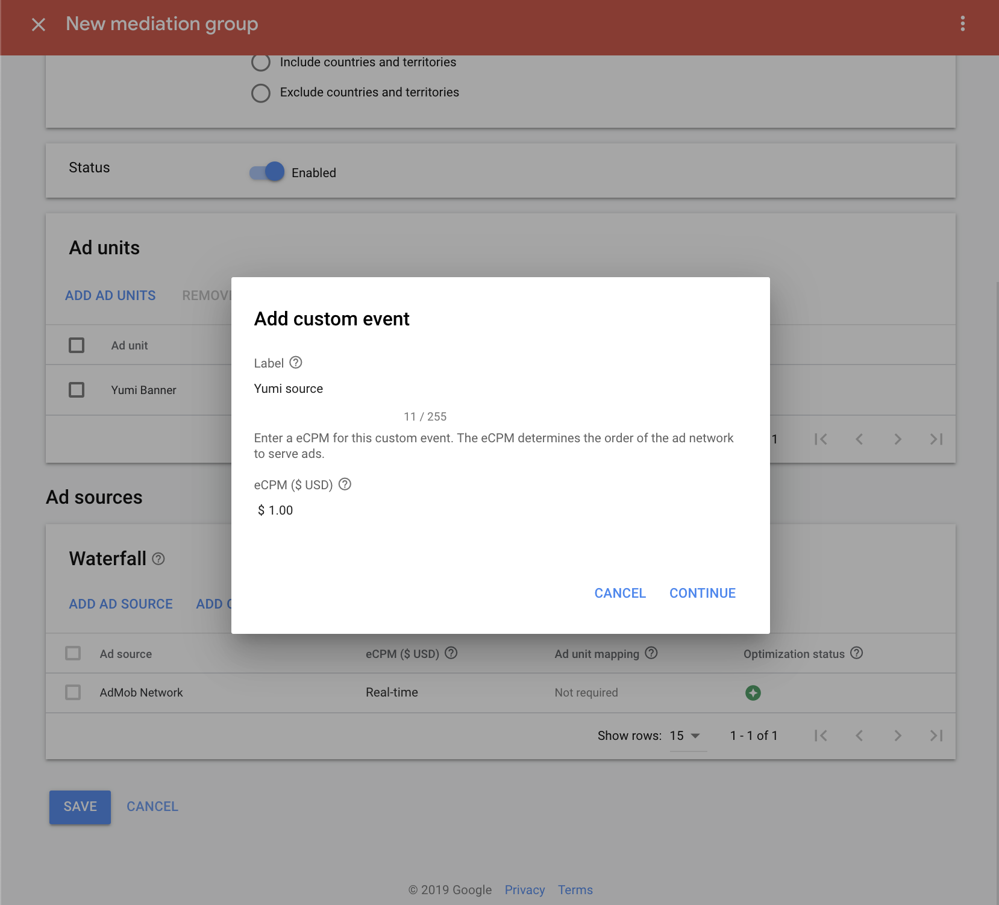
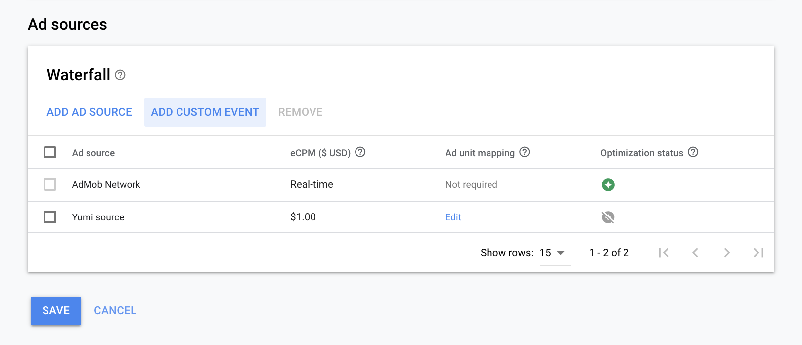

- [1 接入 YumiAd SDK 和 AdMob SDK](#1-%e6%8e%a5%e5%85%a5-yumiad-sdk-%e5%92%8c-admob-sdk)
  - [1.1 添加 YumiAd SDK 依赖](#11-%e6%b7%bb%e5%8a%a0-yumiad-sdk-%e4%be%9d%e8%b5%96)
  - [1.2 添加 AdMob 广告 SDK 依赖](#12-%e6%b7%bb%e5%8a%a0-admob-%e5%b9%bf%e5%91%8a-sdk-%e4%be%9d%e8%b5%96)
  - [1.3 将 Adapter 导入到工程中](#13-%e5%b0%86-adapter-%e5%af%bc%e5%85%a5%e5%88%b0%e5%b7%a5%e7%a8%8b%e4%b8%ad)
- [2 在 AdMob 平台添加 YumiAd 广告源](#2-%e5%9c%a8-admob-%e5%b9%b3%e5%8f%b0%e6%b7%bb%e5%8a%a0-yumiad-%e5%b9%bf%e5%91%8a%e6%ba%90)
- [3 测试 ID](#3-%e6%b5%8b%e8%af%95-ID)


## 1 接入 YumiAd SDK 和 AdMob SDK
### 1.1 添加 YumiAd SDK 依赖
在 app module 的 build.gradle 文件中添加
```groovy
dependencies {
    implementation 'com.yumimobi.ads:yumiad:1.1.1'
}
```
### 1.2 添加 AdMob 广告 SDK 依赖
在 app Module 的 build.gradle 文件中添加
```groovy
dependencies {
    implementation 'com.google.android.gms:play-services-ads:17.2.0'
}
```

### 1.3 将 Adapter 导入到工程中

可以选择将直接将 [admobadapter](./admobadapter) 当作 module 导入到工程中；也可以将 admobadapter 中的各文件粘贴到工程中，各文件如下：

1. [YumiAdBanner.java](./admobadapter/src/main/java/com/yumiad/admobadapter/YumiAdBanner.java) Banner Adapter

2. [YumiAdInterstitial.java](./admobadapter/src/main/java/com/yumiad/admobadapter/YumiAdInterstitial.java) Interstitial Adapter

3. [YumiAdRewardedVideo.java](./admobadapter/src/main/java/com/yumiad/admobadapter/YumiAdRewardedVideo.java) RewardedVideo Adapter

4. [YumiAdUtil.java](./admobadapter/src/main/java/com/yumiad/admobadapter/YumiAdUtil.java) 工具类，包含解析 admob 后台配置的信息，转换错误码等功能

## 2 在 [AdMob 平台](https://apps.admob.com/v2/home)添加 YumiAd 广告源
以下示例是在已有应用（AdmobAdapter-YumiAd），已有广告位（Yumi Banner）上配置 Yumi source。仅供参考，如果实际情况与此不符，请酌情处理。
1. 目录中选择 "[Mediation](https://apps.admob.com/v2/mediation/groups/list)"，选择 "CREATE MEDIATION GROUP"



2. 选择您要使用的广告形式及操作系统，YumiAd 目前支持 Banner, Interstitial 及 Rewarded Video，此处以 Bnner 为例，点击 "CONTINUE" 进入下一步


3. 输入 Name，其它设置保持默认，或参考下图设置。点击 "ADD AD UNIT" 选择要添加的广告位



4. 在广告位选择框中，选择广告位，点击 "DONE" 保存



5. 点击 "ADD CUSTOM EVENT" 添加自定义广告源



6. 输入第三方广告源名称，此处以 Yumi source 为例，可根据需求进行自定义，根据需要对第三方广告源进行价格设置



7. 对 YumiAd 广告源进行配置。在 Class Name 中填写完整的适配器类名，以 demo 中适配器类名为例，

Banner 为 `com.yumiad.admobadapter.YumiAdBanner`

激励视频为 `com.yumiad.admobadapter.YumiAdRewardedVideo`

插屏为 `com.yumiad.admobadapter.YumiAdInterstitial`

Parameter 中需填写您在 YumiAd 申请的 slotId，点击 "DONE" 完成 YumiAd 的配置
```json
{"slotId":"yourSlotId"}
```

测试阶段可以将 **yourSlotId** 替换成 **测试 key**，上线时再改成正式 key。


8. Ad source 列表中可以看到所设置的广告源 YumiAd，点击 "SAVE" 完成 Mediation 的配置



## 3 测试 ID

您在测试中可使用如下 ID 进行测试，测试ID不会产生收益，应用上线时请使用正式 ID。

| 广告形式 | Ad_Unit_id |
| :------: | :--------- |
| 激励视频 | ew9hyvl4   |
| 插屏广告 | 56ubk22h   |
|  Banner  | uz852t89   |